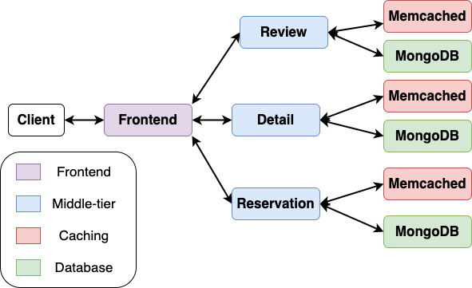

# Welp Restaurants Microservice

This application is a Yelp-like restaurant microservice, developed using Go and gRPC.

<!-- ## Application Structure




The application provides the following functionalities:
- Retrieving restaurant details
- Making and retrieving restaurant reservations
- Posting and retrieving restaurant reviews

## Install Kubernetes

```bash
. ./scripts/k8s_setup.sh
```

## Run Restaurants Applicaton on Kubernetes

```bash
sudo bash scripts/build_images.sh
kubectl apply -f kubernetes/
``` 

## Test the correctness of your implementation

TODO: write a test script.
### Test Script
First, make sure to run the restaurants application on Kubernetes using the instructions above.
Then, run the following commands:
```
cd services_test
go test
```
TODO: write the autograder
TODO: verify gRPC tutorial

## Repo Structure

```
Repo Root
|---- cmd               
  |---- cmd.go          // Main entry point for the application
|---- go.mod            // Module file for the application
|---- proto             // Protocol buffer definitions
|---- services          // Service code
|---- scripts           // util scripts
|---- kubernetes       // kubernetes manifest yaml files
```

### Protocol Buffers 

To generate Go code from the Protocol Buffer definition file, use the following command:

```bash
protoc --go_out=. --go_opt=paths=source_relative \
    --go-grpc_out=. --go-grpc_opt=paths=source_relative \
    <proto file>
```

 -->
