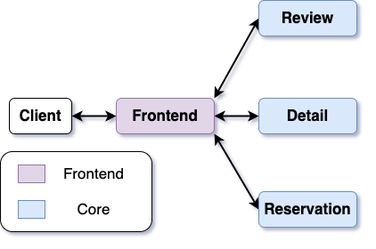

# Lab 1: A Common Cloud Application
<!-- TODO: add overview document. -->

In this lab, you will become familiar with the project infrastructure
and application that we will use in upcoming labs. In particular, you
will get hands-on experience with and even implement parts of the
application that we will run and evaluate from various perspectives in
the remaining labs.

The application we'll build is a Yelp-like restaurants application,
called Welp, that encompasses a range of services, such as providing
information about different restaurants, reviews, and making
reservations. We will start out with a very simple application and
progressively add components. Rather than a traditional monolithic
architecture, where all functionality is tightly coupled, we will
build our application using a modern microservices architecture, such
that different services within the application can be developed and
scaled independently.

**Why Microservices?**  Cloud applications require an adaptable and
efficient approach to effectively operate at scale, deliver content
quickly, and maintain cost-efficiency. The conventional monolithic
architecture approach poses challenges in building, updating, and
scaling applications. Consequently, the adoption of microservices
architectures for cloud applications is on the rise.

This approach entails breaking down applications into smaller, modular
components that communicate through well-defined APIs. Microservices
can be developed using multiple programming languages and seamlessly
added or removed as business requirements evolve, enabling agile and
scalable application lifecycle management.

## Lab 1 Overview

In this lab you will complete a basic implementation of the core RPCs
used in the restaurants application. To start, we will learn how to
create repositories for our container image(s). Next, we will take a
look at the application architecture to understand how different
components of the application fit together. Lastly, you will implement
and deploy your containerized application using Kubernetes.

You will use this infrastructure and evaluate this application in the
further labs. In particular, you will be conducting performance
analysis and performance debugging. Pay close attention to how
different types of user requests are handled in the application and
how the different microservices interact when handling each
request. This understanding is critical for you to be effective in the
later labs.

## Lab 1 Prep Work
We need a place to store and access our container image(s). We will use Docker Hub, a cloud-based registry service provided by Docker that allows us to store, share, and distribute Docker container images. It serves as a central repository where Docker users can find and access a wide range of pre-built container images for various applications, frameworks, and operating systems. 

For sake of simplicity, we will build and re-use a single image for all containers in `cse453`. 
Follow the instructions below to a build the container image for our application and to create a private Docker Hub repository to store the image. Only one of the group member need to do this:

1. **Sign in to Docker Hub**: Open a web browser, navigate to the [Docker Hub website](https://hub.docker.com/) and create a free account. Note: Your password will be stored unencrypted in a file. Please create a dummy account with a bogus password.

2. **Create a Private Repository**: Once logged in, click on the "Create Repository" button. Enter `restaurant_microservice` as your repository name, select **private** visibility, and provide an optional description. Click on "Create" to create the repository. 

3. **Build, Tag, and Push Image**: To upload the Docker images to the respective repositories, you first need to build and tag the images. We provide a script `build_images.sh` to do this. Make sure to specify your docker hub username and image tag with the `-u` and `-t` options respectively. For this lab, use the tag `lab1`.
      ```bash
      # Log in to Docker Hub using credentials from step 1.  
      sudo docker login
      # Build and tag your container images using registry name from step 2. 
      sudo bash scripts/build_images.sh -u <user> -t <tag>
      ```     

4. **Verify the Images**: After pushing the Docker images, you can verify their presence on Docker Hub by visiting the respective repository URLs on Docker Hub. You should be able to see the images listed with their tags and other details. Running `docker images`, you should also see the local build of your image.

5. **Image Registry Access**: Since the image repository is private, create a Kubernetes secret that holds the credentials for accessing that repository. 
    ```bash
    # Create a secret with name `regcred`. Enter your username, password, and email 
    $ kubectl create secret docker-registry regcred --docker-server=https://index.docker.io/v1/ --docker-username=<your-dockerhub-username> --docker-password=<your-dockerhub-password >--docker-email=<your-email@example.com>

    # Verify output
    $ kubectl get secret
    NAME      TYPE                             DATA   AGE
    regcred   kubernetes.io/dockerconfigjson   1      1m5s
    ```
    **Note**: every time you create a new pod, make sure to include the secret in your manifest spec. See `sample.yaml` in `manifests` for an example. A manifest file is  YAML/JSON file which defines the desired state of resources you want to create or manage within a Kubernetes cluster (e.g. Pods, Services, etc.)

    ```yaml
    ...
    spec:
    imagePullSecrets:
        - name: regcred
    ...
    ``` 


## The Welp Application
Now that we are done with creating our container image, let's take a look at our application.
<div style="text-align: center;">
  
</div>
Is that it? Currently, our application is just a frontend service along with three microservices that will implement the core application logic. Throughout the labs, this architecture will get more interesting! Some things to look forward to include implementing a cache service, load balancing, and adding a persistent storage layer. As we add different components, we will also explore how the performance of our application changes.


## Frontend
The frontend is the first layer of our microservices architecture and acts as the gateway between clients and the application. Its primary responsibilities are to present information from the microservices in a user+internet friendly format––we'll go with the HTML format for the HTTP protocol––and handle/forward requests to the appropriate microservices. Currently, our core services are Review, Detail, and Reservation which we will get into soon. We provide a kubernetes manifest file template for the frontend server in `manifests/frontend-deployment.yaml`. Please look at the comments in the YAML file for reference on the different parameters we are using to set up Kubernetes resources. 

Although the frontend does not perform core business logic or data processing, it does expose several HTTP endpoints for external users to interact with the application. An HTTP endpoint is basically just a URL/URI on a web server (i.e our frontend) that represents a communication point for clients to interact with said web server and access resources within the system. Note that our frontend service is assigned to the fixed IP address 10.96.88.88 with port 8080. Currently, we expose the below endpoints on our frontend. Note the use of URL parameters. For those who are unfamiliar, URL parameters are key-value pairs appended to the end of a URL that allow you to send specific data to a web server when making a request to a specific endpoint (See [link](https://www.semrush.com/blog/url-parameters/) for further reference).
<!-- TODO: adjust RPCs to include detail about messages and new RPCs -->
0. `/post-detail` to post details about a restaurant. For example: 
    ```bash
    # Note: 10.96.88.88 is the IP address of the frontend service
    curl "http://10.96.88.88:8080/post-detail?restaurant_name=Oklahoma+Fried+Chicken&location=Seattle,+WA&style=Fast+Food&capacity=100"
    ```
1. `/get-detail` to get the details of a restaurant. For example: 
    ```bash
    curl "http://10.96.88.88:8080/get-detail?restaurant_name=Oklahoma+Fried+Chicken"
    ```
2. `/get-review` to get the review of a restaurant of a user. For example: 
    ```bash
    curl "http://10.96.88.88:8080/get-review?restaurant_name=Oklahoma+Fried+Chicken&user_name=foo"
    ```
3. `/post-review` to post a review for a restaurant. For example: 
    ```bash
    curl "http://10.96.88.88:8080/post-review?user_name=foo&restaurant_name=Oklahoma+Fried+Chicken&review=finger+licking+good&rating=3"
    ```
4. `/search-reviews` to search all reviews of a restaurant. For example: 
    ```bash
    curl "http://10.96.88.88:8080/search-reviews?restaurant_name=Oklahoma+Fried+Chicken"
    ```
5. `/get-reservation` to get the reservations of a user. For example: 
    ```bash
    curl "http://10.96.88.88:8080/get-reservation?user_name=foo" 
    ```
6. `/make-reservation` to make reservations for a user. For example: 
    ```bash
    curl "http://10.96.88.88:8080/make-reservation?user_name=foo&restaurant_name=Oklahoma+Fried+Chicken&year=2023&month=12&day=1"
    ```
7. `/most-popular` to retrieve the top k most popular restaurants. For example: 
    ```bash
    curl "http://10.96.88.88:8080/most-popular?topk=5"
    ```
    
## Detail Microservice 
The `detail` service enables clients to retrieve information about a particular restaurant.

To utilize the `detail` service, clients make gRPC calls to the following RPC methods:
```protobuf
rpc GetDetail(GetDetailRequest) returns (GetDetailResponse);

rpc PostDetail(PostDetailRequest) returns (PostDetailResponse);
```
The RPC `GetDetail` queries and retrieves restaurant details based on restaurant name. The RPC `PostDetail` posts key information about a new restaurant. 

### GetDetailRequest
The `GetDetailRequest` message is used as the request for the `GetDetail` RPC call. It contains a single field:

- `restaurant_name` (string): The name of the restaurant for which you want to retrieve details.

### GetDetailResponse
The `GetDetailResponse` message is used as the response for the `GetDetail` RPC call. It contains the following fields:

- `restaurant_name` (string): The name of the restaurant.
- `location` (string): The location of the restaurant.
- `style` (string): The style of the restaurant.
- `capacity` (int32): The capacity of the restaurant.

### PostDetailRequest
The `PostDetailRequest` message is used as the request for the `PostDetail` RPC call. It contains the following fields:

- `restaurant_name` (string): The name of the restaurant.
- `location` (string): The location of the restaurant.
- `style` (string): The style of the restaurant.
- `capacity` (int32): The capacity of the restaurant.

### PostDetailResponse
The `PostDetailResponse` message is used as the response for the `PostDetail` RPC call. It contains a single field:

- `status` (bool): A boolean indicating the status of the operation (e.g., whether the post was successful).

For your reference, we provide a thoroughly commented implementation of the Details service. 
See [`proto/detail/detail.proto`](../proto/detail/detail.proto) and [`services/detail.go`](../services/detail.go). We recommend reading these files as the implementations for other services follow a similar structure.
However, you will still need to create a Kubernetes manifest file to deploy the Details service. You can refer to the example provided in [`manifests/sample.yaml`](../manifests/sample.yaml) and [`cmd/main.go`](../cmd/main.go) to get started.

<!-- You will need to flesh out the implementation for `services/detail.go`. In particular, you will write the gRPC server code logic. Furthermore, you will need to write a Kubernetes YAML file to deploy the detail service. See the provided example in `manifests/sample.yaml` and `cmd/main.go` for help in getting started. 

In order to implement the detail service RPCs you will need an in-memory structure to store the results of `post-detail` queries so that they can be retrieved by `get-detail` queries. Detail should be fairly straightforward to implement so start here before moving on to Review or Reservation. One implementation model to consider is a one-to-one key-value store.  
Unlike review and reservation, we provide a sample implementation for detail in  [`services/detail.go`](../services/detail.go). However, you will still need to write a Kubernetes manifest file to deploy the detail service. See the provided example in `manifests/sample.yaml` and `cmd/main.go` for help in getting started. -->


## Review Microservice 
The `review` service enables clients to retrieve and post reviews for a particular restaurant.

To utilize the `review` service, clients make gRPC calls to the following RPC methods:
```protobuf
rpc PostReview(PostReviewRequest) returns (PostReviewResponse);
rpc GetReview(GetReviewRequest) returns (GetReviewResponse);
rpc SearchReviews(SearchReviewsRequest) returns (SearchReviewsResponse);
```

The RPC `PostReview` allows clients to post a review and rating for a particular restaurant. The RPC `GetReview` retrieves reviews about a particular restaurant.

### GetReviewRequest
The `GetReviewRequest` message is used as the request for the `GetReview` RPC call. It contains the following fields:

- `restaurant_name` (string): The name of the restaurant for which you want to retrieve reviews.
- `user_name` (string): The name of the user for whom you want to retrieve reviews.

### GetReviewResponse
The `GetReviewResponse` message is used as the response for the `GetReview` and `SearchReviews` RPC calls. It contains the following fields:

- `user_name` (string): The name of the user who posted the review.
- `restaurant_name` (string): The name of the restaurant.
- `review` (string): The review text.
- `rating` (int32): The rating associated with the review.

### PostReviewRequest
The `PostReviewRequest` message is used as the request for the `PostReview` RPC call. It contains the following fields:

- `user_name` (string): The name of the user posting the review.
- `restaurant_name` (string): The name of the restaurant for which the review is being posted.
- `review` (string): The review text.
- `rating` (int32): The rating associated with the review.

### PostReviewResponse
The `PostReviewResponse` message is used as the response for the `PostReview` RPC call. It contains a single field:

- `status` (bool): A boolean indicating the status of the operation (e.g., whether the post was successful).

### SearchReviewsRequest
The `SearchReviewsRequest` message is used as the request for the `SearchReviews` RPC call. It contains the following field:

- `restaurant_name` (string): The name of the restaurant for which you want to search reviews.

### SearchReviewsResponse
The `SearchReviewsResponse` message is used as the response for the `SearchReviews` RPC call. It contains a single field:

- `reviews_map` (map<string, GetReviewResponse>): A map where keys are user names, and values are the corresponding review responses for a given restaurant.

In order to implement the review service RPCs you will again need an in-memory structure to store the results of `post-review` queries so that they can be retrieved by `get-review` queries. You will need to do additional book-keeping in order to track all the reviews associated with a particular restaurant for `search-reviews`. Feel free to use whatever implementation model that comes to mind. Some options might include secondary indices or a larger, nested data structure.  

Note:
- A user can only post one review per restaurant, but a restaurant can have multiple reviews from different users

See [`proto/review/review.proto`](../proto/review/review.proto) and [`services/review.go`](../services/review.go) for more information. You will need to flesh out the implementation for [`services/review.go`](../services/review.go). Furthermore, you will need to write a Kubernetes YAML file to deploy the review service. See the provided example in [`manifests/sample.yaml`](../manifests/sample.yaml) and [`cmd/main.go`](../cmd/main.go) for help in getting started.

## Reservation Microservice
The `reservation` service enables clients to make reservations with
and retrieve reservations from a particular restaurant. It can also
return the K most popular restaurants, based on reservations.

To utilize the `reservation` service, clients make gRPC calls to the following RPC methods:
```protobuf
rpc MakeReservation(MakeReservationRequest) returns (MakeReservationResponse);
    
rpc GetReservation(GetReservationRequest) returns (GetReservationResponse);

rpc MostPopular(MostPopularRequest) returns (MostPopularResponse);
```

The RPC `MakeReservation` allows clients to reserve a spot for a
particular restaurant. The RPC `GetReservation` retrieves reservations
made by a particular user. The RPC `MostPopular` returns the Top K
most popular restaurants in the Welp reservation service. In
particular, we define popularity as the restaurants, which see the
highest number of reservations.

### MakeReservationRequest
The `MakeReservationRequest` message is used as the request for the `MakeReservation` RPC call. It contains the following fields:

- `user_name` (string): The name of the user making the reservation.
- `restaurant_name` (string): The name of the restaurant for which the reservation is being made.
- `time` (Date): The date of the reservation, represented by the `Date` message.

### MakeReservationResponse
The `MakeReservationResponse` message is used as the response for the `MakeReservation` RPC call. It contains a single field:

- `status` (bool): A boolean indicating the status of the reservation operation (e.g., whether the reservation was successful).

### GetReservationRequest
The `GetReservationRequest` message is used as the request for the `GetReservation` RPC call. It contains the following field:

- `user_name` (string): The name of the user for whom you want to retrieve reservations.

### GetReservationResponse
The `GetReservationResponse` message is used as the response for the `GetReservation` RPC call. It contains the following fields:

- `user_name` (string): The name of the user who made the reservation.
- `restaurant_name` (string): The name of the restaurant.
- `time` (Date): The date of the reservation, represented by the `Date` message.

### MostPopularRequest
The `MostPopularRequest` message is used as the request for the `MostPopular` RPC call. It contains a single field:

- `topK` (int32): The number of top restaurants to retrieve.

### MostPopularResponse
The `MostPopularResponse` message is used as the response for the `MostPopular` RPC call. It contains a repeated field:

- `topK_restaurants` (repeated string): A list of restaurant names representing the most popular restaurants.

### Date
The `Date` message is used to represent a date with the following fields:

- `year` (int32): The year of the date.
- `month` (int32): The month of the date.
- `day` (int32): The day of the date.

In order to implement the reservation service RPCs you will need an implementation similar to Detail along with a way to query/track the most popular/reserved restaurants for `/most-popular` Feel free to use whatever implementation model that comes to mind. Some options might include management with a heap or sorting restaurants by frequencies. For simplicity sake, you can define a popularity "point" to be each case of posting new reservation (i.e. a user overwriting a reservation for the same restaurant would count as a different reservation).

See [`proto/reservation/reservation.proto`](../proto/reservation/reservation.proto) and [`services/reservation.go`](../services/reservation.go) for more information. You will need to flesh out the implementation for [`services/reservation.go`](../services/reservation.go). Furthermore, you will need to write a Kubernetes YAML file to deploy the reservation service. See the provided example in [`manifests/sample.yaml`](../manifests/sample.yaml) and [`cmd/main.go`](../cmd/main.go) for help in getting started.


<!-- ## Generating Protobufs
Make sure you compile the protocol buffers for each service by running the following commands. Like in Lab 0, these commands autogenerate the gRPC client/server interfaces (`*_grpc.pb.go`) and message definitions (`*.pb.go`)
<!-- TODO: Remove protobuf autogen files from student releases -->
<!-- ```bash
protoc --go_out=. --go_opt=paths=source_relative --go-grpc_out=. --go-grpc_opt=paths=source_relative proto/detail/detail.proto

protoc --go_out=. --go_opt=paths=source_relative --go-grpc_out=. --go-grpc_opt=paths=source_relative proto/review/review.proto

protoc --go_out=. --go_opt=paths=source_relative --go-grpc_out=. --go-grpc_opt=paths=source_relative proto/reservation/reservation.proto
``` -->

## Assignment (15 points)
Your assignment is to finish implementing the core services in the `services/` directory: Reservation and Review! You'll need an in-memory data structure to hold onto the work a server has done, but implementation specifics are left up to you. We will check whether your Kubernetes pods are healthy and generate load on the endpoints to make sure the output of your application for different requests matches the expected output. For lab1, your solution will be graded on the correctness of the output from querying the different http endpoints. <!-- The actual mechanics of how to implement the gRPC server function are left up to you! -->

We provide a sample autograder for you to check your solution. Start with a clean environment (i.e. delete all Kubernetes resources, delete container images, etc.). You can run the autograder as follows

```shell
# Replace <user> with your docker username
sudo bash scripts/build_images.sh -u <user> -t lab1
REPO_USER=<user> go test services_test/lab1/image_test.go
kubectl apply -f manifests/
# Tests whether your services are live and running without error
go test services_test/lab1/kubernetes_test.go
# Tests whether your service retrieves correct HTTP output for review, reservation, and detail 
go test services_test/lab1/application_test.go
```

## Submission
Submit a tar file of your final lab 1 image. You can generate the tar file using the following command. Make sure to rebuild your image using the `lab1` tag.
```bash
sudo bash scripts/build_images.sh -u <user> -t lab1
sudo docker save -o <groupno>-lab1.tar <user>/restaurant_microservice:lab1
```
Submit your image file to [Gradescope](https://www.gradescope.com/courses/604379/assignments/3474192/)
<!-- for staff: docker load -i image.tar -->

## Tips
A great first attack item is to write the Kubernetes manifest files. Again, we include the manifest for the frontend server in `frontend-deployment.yaml` (remember to change the image name and tag for the frontend). The only thing you need to change in this file is the `image` field to reflect the container image you built. We also include a sample template in [`manifests/sample.yaml`](../manifests/sample.yaml) that you can use as inspiration for writing the manifest files for the Detail, Reservation, and Review services. Once you have them ready, try building the docker images and applying the manifest files. 
```bash
sudo bash scripts/build_images.sh -u <user> -t <tag>
# Create kubernetes resources specified under directory with YAML files
kubectl apply -f manifests/
```  

The application should compile and you should be able to interact with the frontend endpoints. You should see gRPC errors indicating that the core services are unimplemented. If you want to rebuild the application to test your new changes, delete the existing deployment and reapply the manifest files.
```bash
# Delete all services, pods, and deployments  
kubectl delete svc,po,deploy --all
```

For each core service, you should implement the RPCs and add a simple
in-memory data structure that can store and retrieve RPC responses. We
focus on implementing the RPCs / business layer of the application so
that we can take a closer look at RPC performance in subsequent
labs. You do not need to worry about storage, caching, etc. We will explore those topics in later labs - lab 1 is an introduction to our toolchain and how our application is structured.

We will run your solution through a set of sample data to make sure the application produces the correct JSON ouputs for different keys. You can tell that your implementation is working once you can query RPCs and receive the correct output in JSON format. For example,

```bash
$ curl "http://10.96.88.88:8080/post-detail?restaurant_name=Chick-fil-K&location=Seattle,+WA&style=Fast+Food&capacity=100"
{"status":true}

$ curl "10.96.88.88:8080/get-detail?restaurant_name=Chick-fil-K"
{"restaurant_name":"Chick-fil-K","location":"Seattle, WA","style":"Fast Food","capacity":100}
```

As a reminder, here are some useful Kubernetes commands for monitoring and interacting with your application:
- Create Kubernetes resources from manifest files
    ```bash
    kubectl apply -f <manifest_file.yaml>
    kubectl apply -f /path/to/manifests/dir/
    ```
- Delete All Kubernetes resources
    ```bash
    kubectl delete pv,pvc,all --all 
    ```
- Get information about Kubernetes resources:

    ```bash
    kubectl get pods
    kubectl get services
    kubectl get deployments
    kubectl get nodes
    ```
- View detailed information about specific resources (especially useful for debugging)

    ```bash
    kubectl describe pod <pod_name>
    kubectl describe service <service_name>
    kubectl describe deployment <deployment_name>
    kubectl describe node <node_name>
    ```
- Execute commands in a running container:

    ```bash
    kubectl exec -it <pod_name> -- <command>
    ```
- Get logs from a pod: 

    ```bash
    kubectl logs <pod_name>
    ```
___
