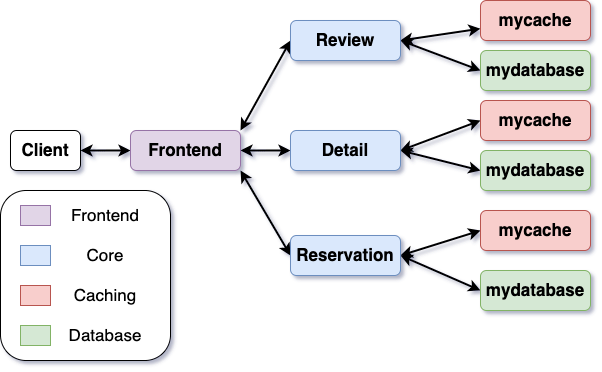

# Lab 3: Caching and Storage

The goal of this lab is to incorporate separate caching and storage layers to our application and look at application performance under the lens of different caching policies and more complex workloads.

## Lab 3 Overview
We will first extend our application by incorporating cache and
storage layers for the core services. Previously, we maintained all
our application state in memory, which provides no durability to our
application. Adding storage provides durability but at the expense of
larger request latencies and response times.

<div style="text-align: center;">
  
</div>

By incorporating intelligent caching policies within a storage layer,
we can improve overall performance by reducing latencies for some
fraction of the overall workload. In particular, our architecture will
incorporate look-aside caching, where the storage and cache layers
provide service independently of each other. As seen above, the core
application service issues RPC requests to the cache for relevant
data. If the data is unavailable (cache miss), the core service issues
an RPC request to the more durable, but slower, storage
service. Scalability is a critical concern for cloud applications and
this approach allows us to scale caches and storage independently.

In the context of Internet services, request popularities often
follow power laws. Power law refers to a distribution of requests
where a minority fraction of values occur at very high frequency and
the rest of the values occur at much lower frequencies. For example,
on an application like Instagram, 20% of all users might generate 80%
of all traffic. In this lab, we will look at how different caching
policies affect the performance of our application under these kinds
of unbalanced workloads.

## Lab 3 Prep Work

We first need to hook in the storage service and a default cache. This
requires us to change a bunch of code.

Make sure to change the tags in your Kubernetes manifests from `lab1` to `lab3`. This way, you can keep your lab1 solution in your Docker Hub repository while also working on your lab3 solution. Feel free to run the following command, replacing `<user>` with your Docker username:
```
sed -i 's/image: .*\/.*/image: <user>\/restaurant_microservice:lab3/g' manifests/*.yaml
```
We will also need to make minor changes to the application. In
particular, we need to modify `cmd/main.go` to intialize the cache and
database services. Copy-paste the following code into `main.go` to
make the necessary changes. 

```go
package main

import (
	"flag"
	"log"
	"os"

	services "gitlab.cs.washington.edu/syslab/cse453-welp/services"
)

type server interface {
	Run() error
}

func main() {
	// Define the flags to specify port numbers and addresses
	var (
		frontendPort     = flag.Int("frontend", 8080, "frontend server port")
		detailPort       = flag.Int("detailport", 8081, "detail service port")
		reviewPort       = flag.Int("reviewport", 8082, "review service port")
		reservationsPort = flag.Int("reservationport", 8083, "reservation service port")

		detailAddr      = flag.String("detailaddr", "detail:8081", "detail service address")
		reviewAddr      = flag.String("reviewaddr", "review:8082", "review service addr")
		reservationAddr = flag.String("reservationaddr", "reservation:8083", "reservation service addr")

		cachePort            = flag.Int("cacheport", 11211, "port used by all caches")
		detailCacheAddr      = flag.String("detail_mycache_addr", "mycache-detail:11211", "details mycache address")
		reviewCacheAddr      = flag.String("review_mycache_addr", "mycache-review:11211", "review mycache address")
		reservationCacheAddr = flag.String("reservation_mycache_addr", "mycache-reservation:11211", "reservation mycache address")

		detailCacheCapacity      = flag.Int("detail_mycache_capacity", 100, "maximum number of K-V entries allowed in the detail cache service")
		reviewCacheCapacity      = flag.Int("review_mycache_capacity", 100, "maximum number of K-V entries allowed in the review cache service")
		reservationCacheCapacity = flag.Int("reservation_mycache_capacity", 100, "maximum number of K-V entries allowed in the reservation cache service")

		databasePort            = flag.Int("databaseport", 27017, "port used by all databases")
		storageDeviceType       = flag.String("storage_device_type", "disk", "specifies emulated storage device type, e.g. option `ssd` or `disk`")
		detailDatabaseAddr      = flag.String("detail_mydatabase_addr", "mydatabase-detail:27017", "details mydatabase address")
		reviewDatabaseAddr      = flag.String("review_mydatabase_addr", "mydatabase-review:27017", "review mydatabase address")
		reservationDatabaseAddr = flag.String("reservation_mydatabase_addr", "mydatabase-reservation:27017", "reservation mydatabase address")
	)

	// Parse the flags
	flag.Parse()

	var srv server
	var cmd = os.Args[1]

	// Switch statement to create the correct service based on the command
	switch cmd {
	case "frontend":
		// Create a new frontend service with the specified ports and addresses
		srv = services.NewFrontend(
			*frontendPort,
			*detailAddr,
			*reviewAddr,
			*reservationAddr,
		)
	case "detail":
		switch {
		case len(os.Args) < 3:
			// Create a new detail service with the specified port
			srv = services.NewDetail(
				"detail",
				*detailPort,
				*detailCacheAddr,
				*detailDatabaseAddr,
			)
		case os.Args[2] == "cache":
			srv = services.NewMyCache(
				"detail-cache",
				*cachePort,
				*detailCacheCapacity,
			)
		case os.Args[2] == "database":
			srv = services.NewMyDatabase(
				"detail-database",
				*databasePort,
				*storageDeviceType,
			)
		default:
			log.Fatalf("unknown subcmd for detail service: %s", os.Args[2])
		}
	case "reservation":
		switch {
		case len(os.Args) < 3:
			// Create a new reservation service with the specified port
			srv = services.NewReservation(
				"reservation",
				*reservationsPort,
				*reservationCacheAddr,
				*reservationDatabaseAddr,
			)
		case os.Args[2] == "cache":
			srv = services.NewMyCache(
				"reservation-cache",
				*cachePort,
				*reservationCacheCapacity,
			)
		case os.Args[2] == "database":
			srv = services.NewMyDatabase(
				"reservation-database",
				*databasePort,
				*storageDeviceType,
			)
		default:
			log.Fatalf("unknown subcmd for reservation service: %s", os.Args[2])
		}
	case "review":
		switch {
		case len(os.Args) < 3:
			// Create a new review service with the specified port
			srv = services.NewReview(
				"review",
				*reviewPort,
				*reviewCacheAddr,
				*reviewDatabaseAddr,
			)
		case os.Args[2] == "cache":
			srv = services.NewMyCache(
				"review-cache",
				*cachePort,
				*reviewCacheCapacity,
			)
		case os.Args[2] == "database":
			srv = services.NewMyDatabase(
				"review-database",
				*databasePort,
				*storageDeviceType,
			)
		default:
			log.Fatalf("unknown subcmd for review service: %s", os.Args[2])
		}
	default:
		// If an unknown command is provided, log an error and exit
		log.Fatalf("unknown cmd: %s", cmd)
	}

	// Start the server and log any errors that occur
	if err := srv.Run(); err != nil {
		log.Fatalf("run %s error: %v", cmd, err)
	}
}
```

Furthermore, we need to change the constructors and structs for each of the core services so that they can communicate with their respective cache and storage servers. In particular, you'll need to initialize the clients for the respective cache and database on each core service *and* specify the addresses for the cache and database within the constructor. We provide an example for `services/detail.go` but make sure to do this for reservation and review, as well.

```go
import(
	// ...

	// Add cache & database proto directories to imports
	"gitlab.cs.washington.edu/syslab/cse453-welp/proto/detail"
	"gitlab.cs.washington.edu/syslab/cse453-welp/proto/mycache"
    "gitlab.cs.washington.edu/syslab/cse453-welp/proto/mydatabase"

	// ... 
)

// Detail implements the detail service
type Detail struct {
	name string
	port int
	detail.DetailServiceServer
	detailCacheClient    mycache.CacheServiceClient // Add detail grpc cache client for communicating with detail cache server
	detailDatabaseClient mydatabase.DatabaseServiceClient // Add detail grpc storage client for communicating with detail storage server
}

// NewDetail returns a new server for the detail service
func NewDetail(name string, detailPort int, detailCacheAddr string, detailDatabaseAddr string) *Detail {
	return &Detail{
		name:                 name,
		port:                 detailPort,
		detailCacheClient:    mycache.NewCacheServiceClient(dial(detailCacheAddr)), // Initialize and establish cxn using specified address
		detailDatabaseClient: mydatabase.NewDatabaseServiceClient(dial(detailDatabaseAddr)), // Initialize and establish cxn using specified address
	}
}
```

Lastly, you need to implement the manifest files for deploying the storage and cache layers for review, detail, and reservation (6 manifest files in total). We provide the following sample solution for the detail storage manifest (Note: the persistent volume and persistent volume claims are not explicitly required since our "storage" layer is actually emulated––see assignment 1––but we include it for purpose of experimentation in lab 4).
```yaml
##################################################################################################
# detail storage service and deployment
##################################################################################################
apiVersion: v1
kind: Service
metadata:
  name: mydatabase-detail
  labels:
    app: mydatabase-detail
    service: mydatabase-detail
spec:
  ports:
  - port: 27017
    name: grpc
  selector:
    app: mydatabase-detail
---
apiVersion: apps/v1
kind: Deployment
metadata:
  name: mydatabase-detail
  labels:
    app: mydatabase-detail
spec:
  replicas: 1
  selector:
    matchLabels:
      app: mydatabase-detail
  template:
    metadata:
      labels:
        app: mydatabase-detail
    spec:
      imagePullSecrets:
      - name: regcred
      containers:
      - name: mydatabase-detail
        image: <user>/restaurant_microservice:lab3
        command: ["/app/restaurant-microservice"]
        args: ["detail", "database"]
        imagePullPolicy: Always
        ports:
        - containerPort: 27017
        resources:
          limits:
            cpu: 1000m # 1 (virtual if on VM) CPU
          requests:
            cpu: 100m # 100 (virtual) millicpus
        volumeMounts:
        - name: data-volume
          mountPath: /var/lib/data
      volumes:
      - name: data-volume
        persistentVolumeClaim:
          claimName: mydatabase-detail-pvc
---
apiVersion: v1
kind: PersistentVolume
metadata:
  name: mydatabase-detail-pv
spec:
  volumeMode: Filesystem
  capacity:
    storage: 1Gi # try changing to 5Gi
  accessModes:
    - ReadWriteMany
  persistentVolumeReclaimPolicy: Retain
  storageClassName: mydatabase-detail-storage
  hostPath:
    path: /data/volumes/mydatabase-detail-pv
    type: DirectoryOrCreate
---
apiVersion: v1
kind: PersistentVolumeClaim
metadata:
  name: mydatabase-detail-pvc
spec:
  accessModes:
    - ReadWriteMany # change to ReadWriteMany if multiple pods using (distributed database)
  storageClassName: mydatabase-detail-storage
  resources:
    requests:
      storage: 1Gi # try changing to 5Gi
---
```

## Assignment 1: Implement Cache (8 points)
For this assignment, you will implement the `mycache` service. The cache and storage APIs will serve as a replacement for our in-memory data structure in lab 1, and allow the core services to issue RPCs to retrieve desired information. 

```protobuf
service CacheService {
  rpc GetItem(GetItemRequest) returns (GetItemResponse) {}
  rpc SetItem(SetItemRequest) returns (SetItemResponse) {}
  rpc DeleteItem(DeleteItemRequest) returns (DeleteItemResponse) {}
}
```
## CacheService

The `CacheService` provides a set of gRPC Remote Procedure Call (RPC) methods for managing an in-memory cache. Clients can interact with the cache by making calls to the RPC methods `GetItem`, `SetItem` and `DeleteItem`. 
1. `GetItem`: issues a get request in a `GetItemRequest` and outputs retrieved data, if it exists, in a `GetItemResponse`.
2. `SetItem`: sets item in the cache as specified in a `SetItemRequest` and returns `SetItemResponse` indicating success of the operation.
3. `DeleteItem`: deletes item from the cache specified in a `DeleteItemRequest` and returns `DeleteItemResponse` indicating success of the operation.

### GetItemRequest

The `GetItemRequest` message is used as the request for the `GetItem` RPC call. It contains the following field:

- `key` (string): The key of the item to retrieve from the cache.

### GetItemResponse

The `GetItemResponse` message is used as the response for the `GetItem` RPC call. It contains a single field:

- `item` (CacheItem): The retrieved cache item.

### SetItemRequest

The `SetItemRequest` message is used as the request for the `SetItem` RPC call. It contains the following field:

- `item` (CacheItem): The cache item to be set in the cache.

### SetItemResponse

The `SetItemResponse` message is used as the response for the `SetItem` RPC call. It contains a single field:

- `success` (bool): A boolean indicating the success of the operation (e.g., whether the item was successfully set in the cache).

### DeleteItemRequest

The `DeleteItemRequest` message is used as the request for the `DeleteItem` RPC call. It contains the following field:

- `key` (string): The key of the item to delete from the cache.

### DeleteItemResponse

The `DeleteItemResponse` message is used as the response for the `DeleteItem` RPC call. It contains a single field:

- `success` (bool): A boolean indicating the success of the operation (e.g., whether the item was successfully deleted from the cache).

### CacheItem

The `CacheItem` message represents an item that can be stored in the cache. It contains the following fields:

- `key` (string): The key associated with the cache item.
- `value` (bytes): The binary data (value) associated with the cache item.

The `CacheService` allows clients to interact with the cache service by performing basic cache operations such as retrieving, setting, and deleting items in the cache. The actual implementation of the cache service may vary, but these RPC methods provide a standardized interface for cache management.

---

First thing to do is implement the manifest files for the caches and database. You can use the provided database manifest files as inspiration.

We provide a simple implementation for an emulated storage service
under `services/mystorage.go`. For the sake of clarity and simplicity
in our performance analysis, we will emulate the performance of
different storage devices instead of using actual physical
hardware. See the struct `EmulatedStorageApp` under
`applications/storage_apps.go` for more details on each emulated
storage device.

Regarding cache policies, we provide a sample implementation of a
[First-in First-out (FIFO)](https://en.wikipedia.org/wiki/Cache_replacement_policies#First_in_first_out_(FIFO)) cache for reference. In general, a FIFO cache will perform
terribly on workloads following a pattern (popularity-based, temporal, user, etc.) since it doesn't incorporate
information about how often keys are accessed, but it is simple to
implement and has low overhead. We also provide implementations of  
[Least Recently Used (LRU)](https://en.wikipedia.org/wiki/Cache_replacement_policies#Least_recently_used_(LRU)) and [Least Frequently Used (LFU)](https://en.wikipedia.org/wiki/Least_frequently_used), 
which perform better on certain types of workloads but are more difficult to implement and more expensive to run.
Finally, we include the Random algorithm, which simply evicts a key at random. 

Your assignment is to implement an additional caching policy of your choice. 
For instance, you could implement [Most Recently Used (MRU)](https://en.wikipedia.org/wiki/Cache_replacement_policies#Most_recently_used_(MRU)) or [Hyperbolic](https://www.usenix.org/system/files/conference/atc17/atc17-blankstein.pdf). 
Your cache implementation should go in `applications/cache_apps.go` and implement the `Cache` interface. Make sure that your constructor is explicitly named `NewCacheApp`. This is so that you can run the lab3 tests for your implementation regardless of which policy you actually implement. 

```go
// Cache is a simple Key-Value cache interface.
type Cache interface {
	// Len returns the number of elements in the cache.
	Len() int

	// Get retrieves the value for the specified key.
	Get(key string) (*mycache.CacheItem, error)

	// Set sets the value for the specified key. If the maximum capacity of the cache is exceeded,
	// an eviction policy is applied.
	Set(item *mycache.CacheItem) error

	// Delete deletes the value for the specified key.
	Delete(key string) error

	// Clear removes all items from the cache.
	Clear()
}
```

In your writeup for assignment 1 make sure to discuss which policy you chose to implement as well as why you chose that policy. 


## Assignment 2: Performance Analysis: Caching Policy (7 points)

Next, we will look at the performance of our application under a more complex workload. In lab 2, we analyzed performance on workloads following a uniform distribution. In other words, each restaurant from our sample data had an equally likely chance of being the next request generated by `wrk2` in the open-loop cycle. Unfortunately, while this pattern is easy to analyze it does not represent real-world workloads. As mentioned in the overview, real-world workloads often follow power laws where a minority of the requests tend to dominate the overall workload. Our mixed workload for lab 3, specified in `workloads/zipf-mixed.lua`, follows a [Zipf distribution](https://en.wikipedia.org/wiki/Zipf%27s_law#:~:text=Zipf), a discrete probability distribution that captures the power law behavior. In particular, given a dataset size $N$ and scaling exponent $`\alpha \geq 0`$, the probability of the $`i^{th}`$ (such that $`1 \leq i \leq N`$) entry occurring is $$ P(X=i | \alpha, N) = \frac{1}{i ^ \alpha} \cdot \frac{1}{\sum_{j =1}^n{1/j^\alpha}}$$

You are tasked with generating throughput-latency
curves, as well as latency CDFs, for the following four scenarios: (1)
application with no cache (just emulated storage), (2) application with your caching policy, and (3,4)
application with your choice of two of the provided caching policies. Make sure to specify emulated SSD storage for all of the above scenarios (see field `storageDeviceType` in `main.go`).

**Note on CacheSize/DatasetSize**: the cache size for each core
service is set to 100 (in `main.go`) but the overall dataset size is
1,000 entries. For each request, `wrk2` will randomly sample from a
Zipfian distribution with $\alpha =1.5$ and $N = 1000$. Our "storage"
layer does not limit the number of entries but the cache holds at most
10% of the overall dataset in this configuration. Hence, there will be
cache misses and each cache miss will force the application to issue a
request to storage, thereby incurring additional latency.

**Note on Latency CDFs**: As we observed in lab2, averages can be
deceiving when evaluating the performance of an application. Drawing an empirical
cumulative distribution function (eCDF) for latency data is a useful
way to visualize and analyze the distribution of measured latency values. In our case, the eCDF shows how for a given latency value $x$, what percentage of the RPCs took less time than $x$.

You should include latency (in milliseconds) on the x-axis
and the percentile on the y-axis. For our purposes, it will be
sufficient to generate your graph using the latency distribution
histogram output by `wrk2` (instead of recording and plotting every
datapoint).

**Note on Running `wrk2`**: We will run `wrk2` in a similar way to lab2. However, instead of varying the arrival distribution, make sure to use exponential distribution for all your runs. For example,
`
./wrk2/wrk -D exp -t 10 -c 100 -d30s -s ./workloads/lab3/zipf-mixed.lua http://10.96.88.88:8080 -R 2000 -L
`. 
 Generate the latency-throughput graphs in the same way as in lab2 by specifying load, and seeing how the latencies increase with load. Use the same number of threads (`t`) and connections (`c`) you used in lab2.

Before running the experiments, formulate a hypothesis for
the ranking of the above caching scenarios from best to worst. Once you have graphs and latency CDFs for each scenario, answer the following
discussion questions in your writeup:

- What maximum throughput under the SLA from lab 2 is each scenario able
  to achieve? Do achieved throughputs match your expectations? Explain
  why each policy performs the way it does under the SLA.

- How does the request latency distribution change for each of the
  policies? Why does each policy achieve a certain distribution?

- Which requests frequently hit in the cache and which requests are
  frequently evicted? Why?

<!-- - In a larger distributed system, how would you achieve load balancing when dealing with Zipfian workloads? -->

<!-- - Our storage system in Welp was limited to retrieving individual items one at a time. How would you design a data storage system (e.g., database) to efficiently store and retrieve data with Zipfian distribution? -->

- Assume that we needed to increase the application performance by 100x. How can you ensure that the system scales with skewed access patterns?


<!-- ## Assignment 3: Performance Analysis: Storage Device (5 points)

Using the best performing cache policy from Assignment 2, generate
throughput-latency curves for your application using the following
kinds of emulated storage: (1) consumer-grade SSD, (2) commodity disk
drive, (3) cloud storage service. Again, write down your hypothesis on
how the scenarios will compare before running the experiments.

What differences do you observe between the three setups? Discuss your
results. Incorporate the bottleneck analysis strategy from lab 2 into
your analysis here. Do bottlenecks shift to among services in your
application when different storage devices are used? -->
